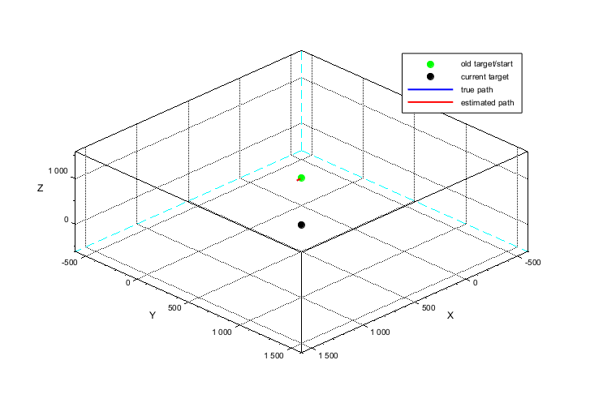

# Flightpath-Navigation
Flight navigation towards targets simulating flight paths. Simulates GPS outages and estimating the position with flawed gyroscope measurements. Self corrects this when receiving GPS Signal.

Functionality: 
- Navigation.sci, finds the best path to the target based on the estimated position of the aircraft
- Simulationstep.sci, simulates 1 timestep of the pyhsical flightpath based on the route Navigation.sci suggests
- Estimatonstep.sci, estimates the position of the aircraft based on gyroscope measurements that contain biases
- History.sci, records estimated and actual flightpath
- Renderer.sci, creates and updates the 3D plot
- Correction.sci, every 100 calculation steps gps returns and is used to correct for the gyroscope bias.

How to use it: 

- download the repository and Scilab
- adjust the exec data paths in main to your folder

